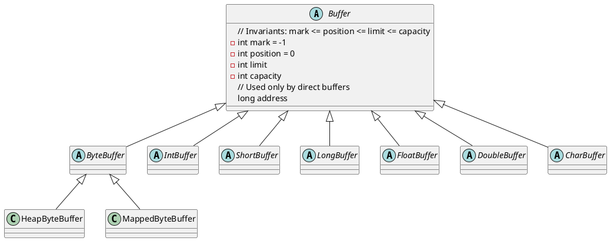

java.nio.Buffer

缓存实质上就是一个数组，提供了对数据的结构化访问以及维护读写位置等信息。

## hierarchy
```
Buffer (java.nio)
    IntBuffer (java.nio)
    FloatBuffer (java.nio)
    CharBuffer (java.nio)
    DoubleBuffer (java.nio)
    ShortBuffer (java.nio)
    LongBuffer (java.nio)
    ByteBuffer (java.nio)
```

## define
