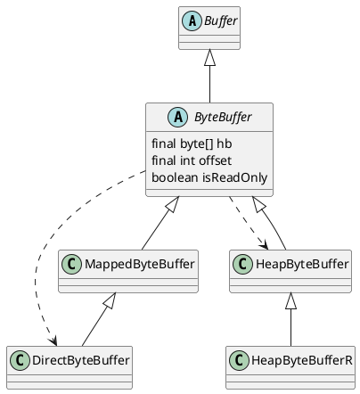

java.nio.ByteBuffer

## hierarchy
```
Buffer (java.nio)
    ByteBuffer (java.nio)
        HeapByteBuffer (java.nio)
            HeapByteBufferR (java.nio)
        MappedByteBuffer (java.nio)
            DirectByteBuffer (java.nio)
                DirectByteBufferR (java.nio)
    IntBuffer (java.nio)
    FloatBuffer (java.nio)
    CharBuffer (java.nio)
    DoubleBuffer (java.nio)
    ShortBuffer (java.nio)
    LongBuffer (java.nio)
```

## define

## methods

```java
public static ByteBuffer allocateDirect(int capacity) {
    return new DirectByteBuffer(capacity);
}

public static ByteBuffer allocate(int capacity) {
    if (capacity < 0)
        throw new IllegalArgumentException();
    return new HeapByteBuffer(capacity, capacity);
}
```