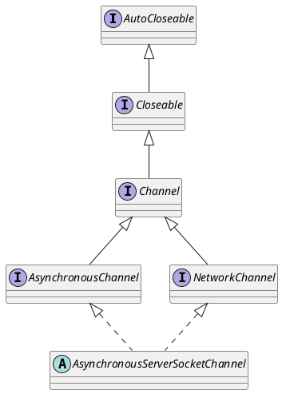

java.nio.channels.AsynchronousServerSocketChannel

## package
```
AsynchronousServerSocketChannel (java.nio.channels)
    AsynchronousServerSocketChannelImpl (sun.nio.ch)
        WindowsAsynchronousServerSocketChannelImpl (sun.nio.ch)
```

## define



## methods
* provider
* open
* open
* bind
* bind
* setOption
* accept
* accept
* getLocalAddress