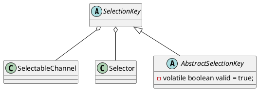

java.nio.channels.SelectionKey


* volatile
* synchronized

## hierarchy
```
SelectionKey (java.nio.channels)
    AbstractSelectionKey (java.nio.channels.spi)
        SelectionKeyImpl (sun.nio.ch)
```

## define
