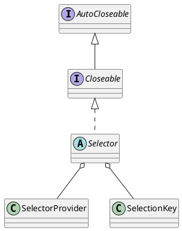

java.nio.channels.Selector

## package
```
Selector (java.nio.channels)
    AbstractSelector (java.nio.channels.spi)
        SelectorImpl (sun.nio.ch)
            WindowsSelectorImpl (sun.nio.ch)
    SelectedSelectionKeySetSelector (io.netty.channel.nio)
```
## define


## methods
* open
* isOpen
* provider
* keys
* selectedKeys
* selectNow
* select
* select
* wakeup
* close

