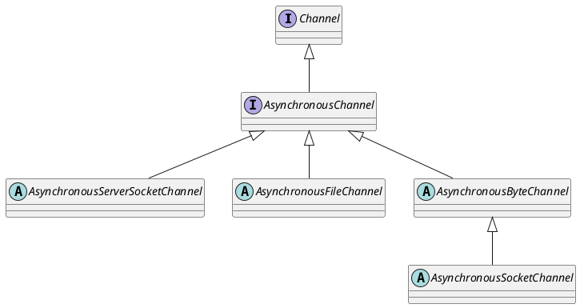

java.nio.channels.AsynchronousChannel

## hierarchy
```
AsynchronousChannel (java.nio.channels)
    AsynchronousServerSocketChannel (java.nio.channels)
        AsynchronousServerSocketChannelImpl (sun.nio.ch)
    AsynchronousFileChannel (java.nio.channels)
        AsynchronousFileChannelImpl (sun.nio.ch)
    AsynchronousByteChannel (java.nio.channels)
        Nio2Channel (org.apache.tomcat.util.net)
        AsynchronousSocketChannel (java.nio.channels)
```

## define

