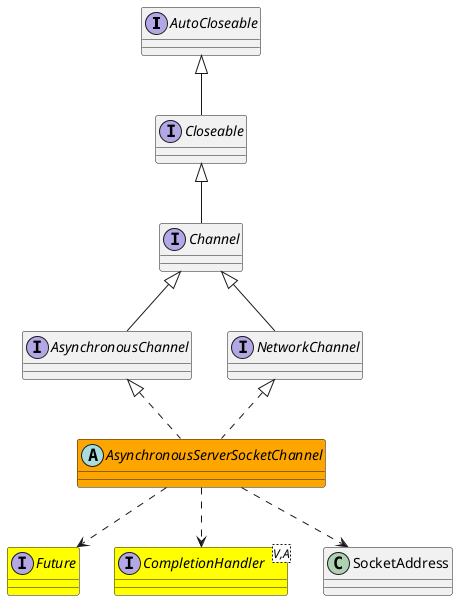

java.nio.channels.AsynchronousServerSocketChannel

## package
```
AsynchronousServerSocketChannel (java.nio.channels)
    AsynchronousServerSocketChannelImpl (sun.nio.ch)
        WindowsAsynchronousServerSocketChannelImpl (sun.nio.ch)
AsynchronousChannel (java.nio.channels)
    Channel (java.nio.channels)
        Closeable (java.io)
            AutoCloseable (java.lang)
    NetworkChannel (java.nio.channels)
        Channel (java.nio.channels)
            Closeable (java.io)
                AutoCloseable (java.lang)
```

## define



## methods
* provider
* public static AsynchronousServerSocketChannel open(AsynchronousChannelGroup group)
* public static AsynchronousServerSocketChannel open()
* bind
* bind
* setOption
* accept
* accept
* getLocalAddress