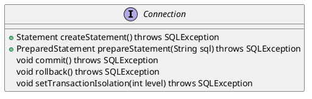

java.sql.Connection

## hierarchy

## define

```plantuml
@startuml

interface Connection {
    + Statement createStatement() throws SQLException
    + PreparedStatement prepareStatement(String sql) throws SQLException
    void commit() throws SQLException
    void rollback() throws SQLException
    void setTransactionIsolation(int level) throws SQLException
}

@enduml
```