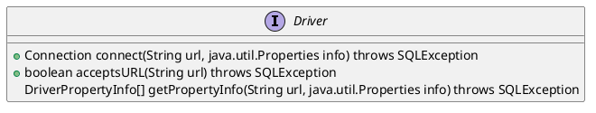
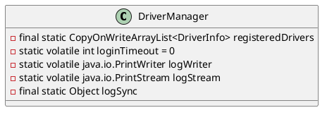

java.sql.Driver

## hierarchy
```
Driver (java.sql)
    Driver (com.mysql.cj.jdbc)
        Driver (com.mysql.jdbc)
    DruidDriver (com.alibaba.druid.proxy)
    DriverSpy (net.sf.log4jdbc.sql.jdbcapi)
    NonRegisteringDriver (com.mysql.cj.jdbc)
        Driver (com.mysql.cj.jdbc)
    MockDriver (com.alibaba.druid.mock)
    DriverProxy in UnpooledDataSource (org.apache.ibatis.datasource.unpooled)
```

## define




java.sql.DriverManager

## define
