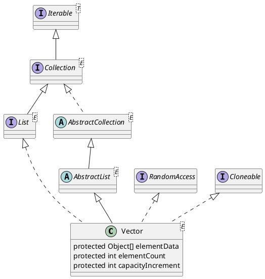

java.util.Vector

向量 矢量
## hierarchy

## define

```plantuml
@startuml

class Vector<E> {
    protected Object[] elementData
    protected int elementCount
    protected int capacityIncrement
}

interface Iterable<T> 
interface Collection<E>
interface List<E>

abstract class AbstractCollection<E>
abstract class AbstractList<E>

interface RandomAccess
interface Cloneable

Iterable ^-- Collection
Collection ^-- List
List ^.. Vector
RandomAccess ^.. Vector
Cloneable ^.. Vector

Collection ^.. AbstractCollection
AbstractCollection ^-- AbstractList
AbstractList ^-- Vector

@enduml
```

