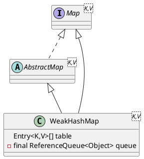

java.util.WeakHashMap

## define

```plantuml
@startuml
interface Map<K,V> 
abstract class AbstractMap<K,V>

Map ^.. AbstractMap
AbstractMap ^-- WeakHashMap
Map ^-- WeakHashMap

class WeakHashMap<K,V> {
    Entry<K,V>[] table
    - final ReferenceQueue<Object> queue
}

@enduml
```