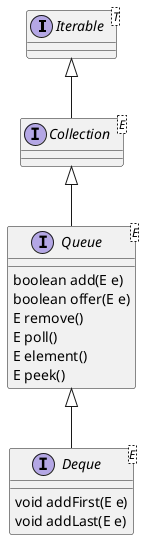

java.util.Deque

## hierarchy
```
Deque (java.util)
    ForwardingDeque (com.google.common.collect)
    SynchronizedDeque in Synchronized (com.google.common.collect)
    BlockingDeque (java.util.concurrent)
    ListAdapter (jdk.nashorn.internal.runtime)
    LinkedList (java.util)
    ArrayDeque (java.util)
    LinkedBlockingDeque (org.apache.commons.pool2.impl)
    IdentityLinkedList (sun.awt.util)
    ConcurrentLinkedDeque (java.util.concurrent)
```

## define
