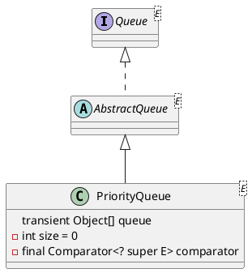

java.util.PriorityQueue

## define

```plantuml
@startuml

interface Queue<E>
abstract class AbstractQueue<E>

Queue ^.. AbstractQueue

AbstractQueue ^-- PriorityQueue
class PriorityQueue<E> {
    transient Object[] queue
    - int size = 0
    - final Comparator<? super E> comparator
}

@enduml
```