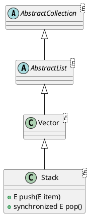

java.util.Stack

## hierarchy
```
AbstractCollection (java.util)
    AbstractList (java.util)
        Vector (java.util)
            Stack (java.util)
```

## define

```plantuml
@startuml

abstract class AbstractCollection<E>
abstract class AbstractList<E>
class Vector<E>

AbstractCollection ^-- AbstractList
AbstractList ^-- Vector
Vector ^-- Stack

class Stack<E> {
    + E push(E item)
    + synchronized E pop()
}

@enduml
```