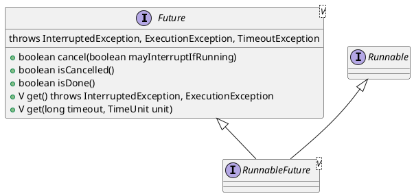

java.util.concurrent.Future

## hierarchy
```
Future (java.util.concurrent)
    RunnableFuture (java.util.concurrent)
        RunnableScheduledFuture (java.util.concurrent)
            ScheduledFutureTask in ScheduledThreadPoolExecutor (java.util.concurrent)
            RunnableScheduledFutureTask in UnorderedThreadPoolEventExecutor (io.netty.util.concurrent)
        AdaptedRunnableAction in ForkJoinTask (java.util.concurrent)
        FutureTask (java.util.concurrent)
    ForkJoinTask (java.util.concurrent)
        RecursiveTask (java.util.concurrent)
        CountedCompleter (java.util.concurrent)
        AsyncSupply in CompletableFuture (java.util.concurrent)
        RunnableExecuteAction in ForkJoinTask (java.util.concurrent)
        AsyncRun in CompletableFuture (java.util.concurrent)
        AdaptedRunnable in ForkJoinTask (java.util.concurrent)
        RecursiveAction (java.util.concurrent)
        Completion in CompletableFuture (java.util.concurrent)
        AdaptedCallable in ForkJoinTask (java.util.concurrent)
        EmptyTask in ForkJoinPool (java.util.concurrent)
        AdaptedRunnableAction in ForkJoinTask (java.util.concurrent)
    ScheduledFuture (java.util.concurrent)
        RunnableScheduledFuture (java.util.concurrent)
            ScheduledFuture (io.netty.util.concurrent)
            ScheduledFutureTask in ScheduledThreadPoolExecutor (java.util.concurrent)
    CompletableFuture (java.util.concurrent)
    Response (javax.xml.ws)
    FutureWrapper (jdk.management.resource.internal)
```

## define
