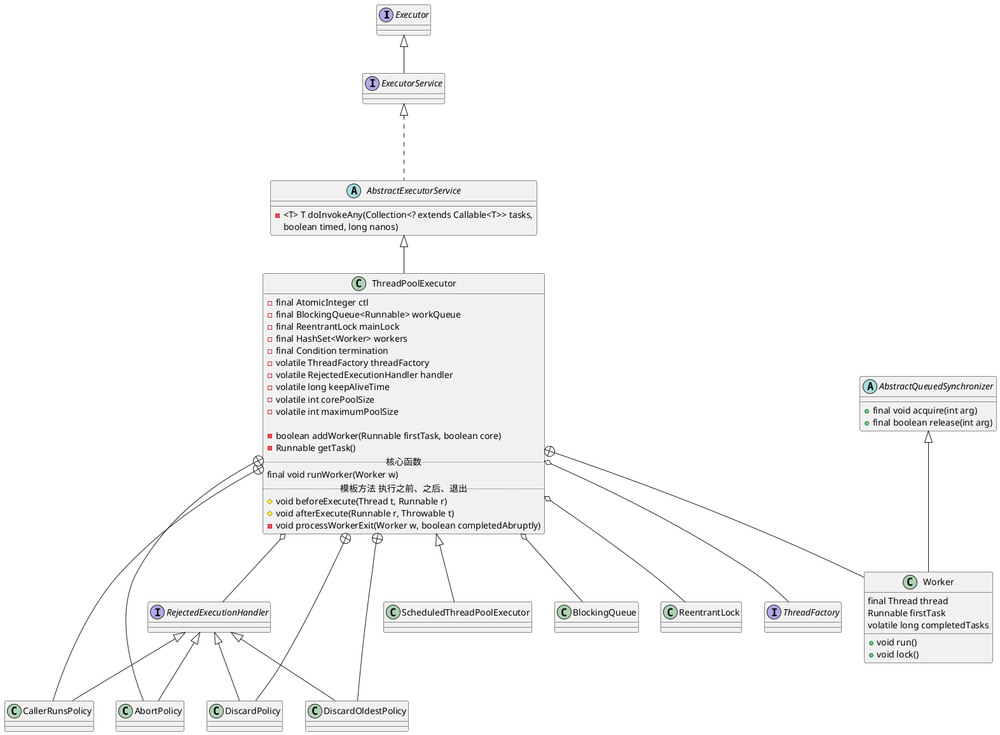
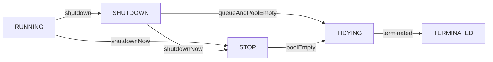

java.util.concurrent.ThreadPoolExecutor

## hierarchy
```
Executor
    ExecutorService
        AbstractExecutorService (java.util.concurrent)
            ThreadPoolExecutor (java.util.concurrent)
                BrokerFixedThreadPoolExecutor (org.apache.rocketmq.broker.latency)
                ComInvoker in Win32ShellFolderManager2 (sun.awt.shell)
                MemoryAwareThreadPoolExecutor (org.jboss.netty.handler.execution)
                QuantumRenderer (com.sun.javafx.tk.quantum)
                ScheduledThreadPoolExecutor (java.util.concurrent)
                ThreadPoolExecutor (org.apache.tomcat.util.threads)
                WorkerPoolExecutor (org.apache.http.impl.bootstrap)
```

## define
* 内部类
  * Worker
* 域
  * 工作队列
  * 全局锁
  * 工作线程集合
  * 全局锁条件
  * 线程工厂
  * 饱和策略
  * 存活时间
  * 核心线程池数量
  * 最大线程池数量



## 状态图

* RUNNING(-1):  Accept new tasks and process queued tasks
* SHUTDOWN(0): Don't accept new tasks, but process queued tasks
* STOP(1):     Don't accept new tasks, don't process queued tasks,
            and interrupt in-progress tasks
* TIDYING(2):  All tasks have terminated, workerCount is zero,
            the thread transitioning to state TIDYING
            will run the terminated() hook method
* TERMINATED(3): terminated() has completed
     


## execute()

```mermaid
sequenceDiagram
    Actor->>ThreadPoolExecutor:execute(command)
    
    %% 1. 原子变量获得状态和数量
    ThreadPoolExecutor->>AtomicInteger:获得线程池状态和线程数量get()
    
    %% 2. 小于核心线程池数量
    opt workerCount < corePoolSize
        opt
            ThreadPoolExecutor->>ThreadPoolExecutor:addWorker(command, true)添加核心线程的Worker
        end
    end
    
    %% 3. 添加任务失败
    alt isRunning(c)并且可以取出任务
        
        ThreadPoolExecutor->>AtomicInteger:重新获得线程池状态和线程数量get()
        
        alt 不是运行状态并且可以删除任务
            ThreadPoolExecutor->>ThreadPoolExecutor:reject(command)
            ThreadPoolExecutor->>RejectedExecutionHandler:rejectedExecution(command,this)
            
        else 工作线程的数量等于0
            ThreadPoolExecutor->>ThreadPoolExecutor:addWorker(null, false)添加非核心线程的Worker
        end
        
    else 不能添加非核心线程Worker
        ThreadPoolExecutor->>ThreadPoolExecutor:reject(command)
        ThreadPoolExecutor->>RejectedExecutionHandler:rejectedExecution(command,this)
    end
```