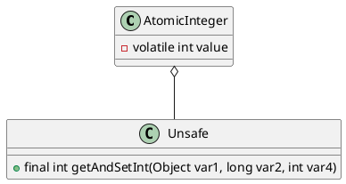

java.util.concurrent.atomic.AtomicInteger

## define
* volatile int
* cas
* for/while



### Unsafe
* getAndSetInt
* getIntVolatile
* compareAndSwapInt


* getObjectVolatile
* getAndSetObject
* compareAndSwapObject

```
public final Object getAndSetObject(Object var1, long var2, Object var4) {
    Object var5;
    do {
        var5 = this.getObjectVolatile(var1, var2);
    } while(!this.compareAndSwapObject(var1, var2, var5, var4));

    return var5;
}
```