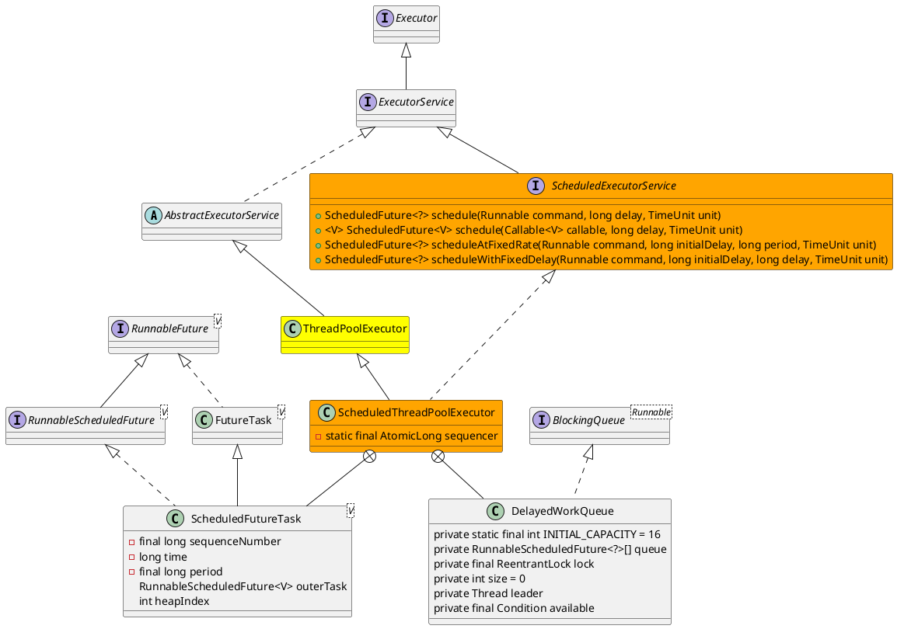

java.util.concurrent.ScheduledThreadPoolExecutor

## hierarchy
```
AbstractExecutorService (java.util.concurrent)
    ThreadPoolExecutor (java.util.concurrent)
        ScheduledThreadPoolExecutor (java.util.concurrent)
            UnorderedThreadPoolEventExecutor (io.netty.util.concurrent)
ScheduledThreadPoolExecutor (java.util.concurrent)
    ThreadPoolExecutor (java.util.concurrent)
        AbstractExecutorService (java.util.concurrent)
            Object (java.lang)
            ExecutorService (java.util.concurrent)
                Executor (java.util.concurrent)
    ScheduledExecutorService (java.util.concurrent)
        ExecutorService (java.util.concurrent)
            Executor (java.util.concurrent)
```

## define
