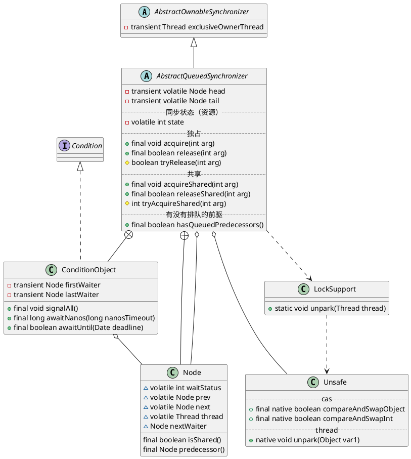

java.util.concurrent.locks.AbstractQueuedSynchronizer

## hierarchy
```
AbstractOwnableSynchronizer (java.util.concurrent.locks)
    AbstractQueuedSynchronizer (java.util.concurrent.locks)
        Worker in ThreadPoolExecutor (java.util.concurrent)
        Sync in CountDownLatch (java.util.concurrent)
        Sync in ReentrantLock (java.util.concurrent.locks)
            FairSync in ReentrantLock (java.util.concurrent.locks)
            NonfairSync in ReentrantLock (java.util.concurrent.locks)
        Sync in ReentrantReadWriteLock (java.util.concurrent.locks)
            FairSync in ReentrantReadWriteLock (java.util.concurrent.locks)
            NonfairSync in ReentrantReadWriteLock (java.util.concurrent.locks)
        Sync in Semaphore (java.util.concurrent)
            FairSync in Semaphore (java.util.concurrent)
            NonfairSync in Semaphore (java.util.concurrent)
        Sync in CountDownLatch2 (org.apache.rocketmq.common)
        Sync in LimitLatch (org.apache.tomcat.util.threads)
        LockableObject (org.codehaus.groovy.util)
            Segment in AbstractConcurrentMapBase (org.codehaus.groovy.util)
            LazyReference (org.codehaus.groovy.util)
```

## define
* volatile int 同步状态、信号量
* FIFO 同步队列、双向链表
* Condition 条件变量、等待队列、通知、等待
* 继承、静态内部类；委派模式
* 模板方法模式
  * 独占式获取与释放同步状态
  * 共享式获取与释放同步状态
  * 查询同步队列中等待线程情况



## methods
### compareAndSetTail(Node expert, Node update)
### 独占式 void acquire(int arg)
* !tryAcquire(arg)
* addWaiter(Node.EXCLUSIVE), arg) 将节点加到同步队列的尾部（compareAndSetTail + for循环）
* acquireQueued() 自旋，每个节点自省观察，前驱节点是头节点时，才能够获取同步状态`tryAcquire(arg)`；获取到同步状态就可以从这个自旋过程中退出。
  * selfInterrupt()

### 独占式 boolean release(int arg)
  
### 共享式 void acquireShared(int arg)
* tryAcquireShared(arg) < 0 尝试获取同步状态，返回值大于o，能够获取同步状态
  * doAcquireShared(arg) 
    * addWaiter(Node.SHARED) 
    * 自旋，当前节点的前趋节点为头节点时，尝试获取同步状态`tryAcquireShared(arg)`，如果返回值大于等于0，表示获取成功退出自旋。

### 共享式 boolean releaseShared(int arg) 
