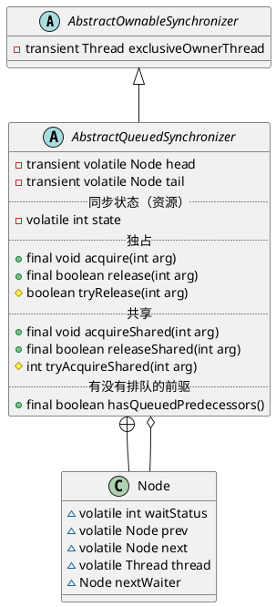

java.util.concurrent.locks.AbstractQueuedSynchronizer

## hierarchy
```
AbstractOwnableSynchronizer (java.util.concurrent.locks)
    AbstractQueuedSynchronizer (java.util.concurrent.locks)
        Sync in CountDownLatch (java.util.concurrent)
        Worker in ThreadPoolExecutor (java.util.concurrent)
        Sync in LimitLatch (org.apache.tomcat.util.threads)
        Sync in ReentrantLock (java.util.concurrent.locks)
            FairSync in ReentrantLock (java.util.concurrent.locks)
            NonfairSync in ReentrantLock (java.util.concurrent.locks)
        Sync in CountDownLatch2 (org.apache.rocketmq.common)
        Sync in ReentrantReadWriteLock (java.util.concurrent.locks)
            FairSync in ReentrantReadWriteLock (java.util.concurrent.locks)
            NonfairSync in ReentrantReadWriteLock (java.util.concurrent.locks)
        LockableObject (org.codehaus.groovy.util)
            Segment in AbstractConcurrentMapBase (org.codehaus.groovy.util)
            LazyReference (org.codehaus.groovy.util)
        Sync in Semaphore (java.util.concurrent)
            FairSync in Semaphore (java.util.concurrent)
            NonfairSync in Semaphore (java.util.concurrent)
```

## define


