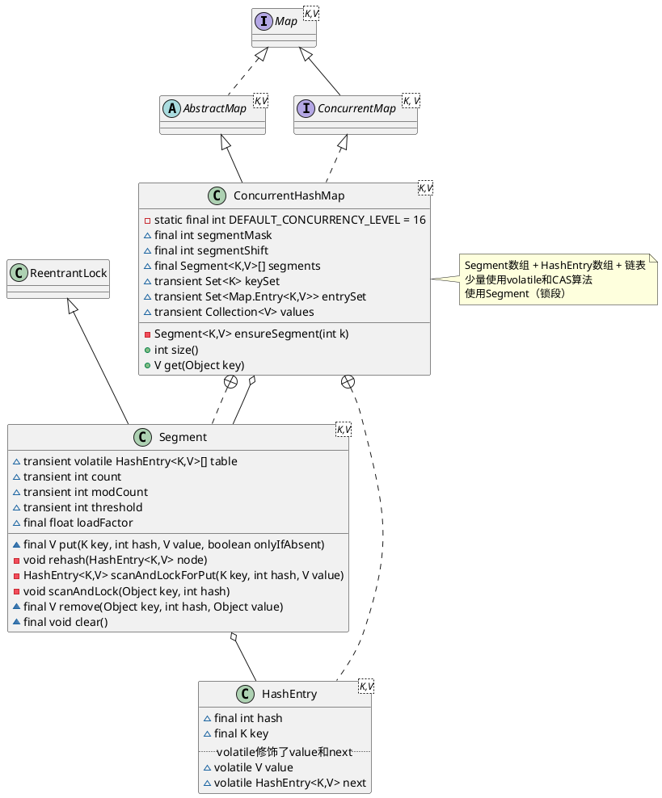

java.util.concurrent.ConcurrentHashMap

| version | core struct                        | volatile, cas             | lock                  |
| :------ | :--------------------------------- | :------------------------ | :-------------------- |
| jdk7    | Segment数组 + HashEntry数组 + 链表 | 少量使用volatile和CAS算法 | 使用Segment（锁段）   |
| jdk8    | Node数组 + 链表 + 红黑树           | 大量使用volatile和CAS算法 | 摒弃了Segment（锁段） |

锁的粒度、读写分离（读写锁）

# 1. jdk7 ConcurrentHashMap
* 分段锁，HashTable表锁
  * Segment 类似HashMap结构，内部拥有Entry数组，数组中的每个元素有时一个链表
  * 继承ReentrantLock 
* CAP BASE 弱一致性，HashTable的迭代器是强一致性的


#### volatile
HashEntry中的value以及next都被volatile修饰，这样在多线程读写过程中能够保持它们的可见性
#### 并发度
并发度可以理解为程序运行时能够同时更新ConccurentHashMap且不产生锁竞争的最大线程数，实际上就是ConcurrentHashMap中的分段锁个数，即Segment[]的数组长度
#### 创建，延迟初始化
和JDK6不同，JDK7中除了第一个Segment之外，剩余的Segments采用的是延迟初始化的机制：
每次put之前都需要检查key对应的Segment是否为null，如果是则调用ensureSegment()以确保对应的Segment被创建。
#### rehash
相对于HashMap的resize，ConcurrentHashMap的rehash原理类似，但是Doug Lea为rehash做了一定的优化，避免让所有的节点都进行复制操作


## 1.1 define
* 静态域
  * DEFAULT_INITIAL_CAPACITY = 16
  * DEFAULT_LOAD_FACTOR = 0.75F
  * DEFAULT_CONCURRENCY_LEVEL = 16
  * MAXIMUM_CAPACITY = 1073741824
  * MIN_SEGMENT_TABLE_CAPACITY = 2
  * MAX_SEGMENTS = 65536
  * RETRIES_BEFORE_LOCK = 2
* 实例域
  * final int segmentMask
  * final int segmentShift
  * final ConcurrentHashMap.Segment<K, V>[] segments
  * transient Set<K> keySet
  * transient Set<Entry<K, V>> entrySet
  * transient Collection<V> values
* 内部类
  * EntryIterator
  * EntrySet
  * HashEntry
  * HashIterator
  * Holder
  * KeyIterator
  * KeySet
  * Segment
  * ValueIterator
  * Values
  * WriteThroughEntry




## 1.2 初始化

## 1.3 put/putIfAbsent/putAll
* Segment 内部是由 数组 + 链表 组成的。
* 初始化槽: ensureSegment
* 获取写入锁: scanAndLockForPut
* 扩容: rehash segment 数组不能扩容，扩容是 segment 数组某个位置内部的数组 HashEntry[] 进行扩容，扩容后，容量为原来的 2 倍。

获取锁的过程中对整个链表进行遍历，主要目的是希望遍历的链表被CPU cache所缓存，为后续实际put过程中的链表遍历操作提升性能。

## 1.4 get与containsKey
get与containsKey两个方法几乎完全一致：他们都没有使用锁，而是通过Unsafe对象的`getObjectVolatile()`方法提供的原子读语义，来获得Segment以及对应的链表，
然后对链表遍历判断是否存在key相同的节点以及获得该节点的value。

Unsafe.getObjectVolatile() 获取对象内存地址偏移量上的数值v  

但由于遍历过程中其他线程可能对链表结构做了调整，因此get和containsKey返回的可能是**过时**的数据，这一点是ConcurrentHashMap在**弱一致性**上的体现。
如果要求强一致性，那么必须使用Collections.synchronizedMap()方法。

## 1.5 remove
和put类似，remove在真正获得锁之前，也会对链表进行遍历以提高缓存命中率

## 1.6 size、containsValue
ConcurrentHashMap在统计size时，经历了两次遍历：
第一次不加锁地遍历所以segment，统计count和modCount的总和得到C1和M1；然后再次不加锁地遍历，得到C2和M2，比较M1和M2，
如果修改次数没有发生变化则说明两次遍历期间map没有发生数量变化，那么C1就是可用的。
如果M1不等于M2，则说明在统计过程中map的数量发生了变化，此时才采取最终手段——锁住整个map进行统计。

## 1.7 rehash
相对于HashMap的resize，ConcurrentHashMap的rehash原理类似


# 2. jdk8 ConcurrentHashMap
* 53个内部类
* 91个方法
* 1个静态代码块
* 37个字段，其中27个常量、10个字段


## 2.1 define
* 静态域
* 实例域
* 内部类

```plantuml
@startuml

''''''''''''''''''''''''' Map ''''''''''''''''''''''''''''''
interface Map<K,V>
abstract class AbstractMap<K,V> 
Map ^.. AbstractMap

''''''''''''''''''''''''' ConcurrentMap ''''''''''''''''''''''''''''''
interface ConcurrentMap<K, V>
Map ^-- ConcurrentMap

class ConcurrentHashMap<K,V> {
    - static final int DEFAULT_CONCURRENCY_LEVEL = 16
    ~ transient volatile Node<K,V>[] table
    - transient volatile Node<K,V>[] nextTable
    - transient volatile long baseCount
    - transient volatile int sizeCtl
    - transient volatile CounterCell[] counterCells
    - final Node<K,V>[] initTable()
}

note right
Node数组 + 链表 + 红黑树
大量使用volatile和CAS算法
摒弃了Segment（锁段）的概念
end note

AbstractMap ^-- ConcurrentHashMap
ConcurrentMap ^.. ConcurrentHashMap

''''''''''''''''''''''''' Segment ''''''''''''''''''''''''''''''
class ReentrantLock
class Segment<K,V> {
    ~ final float loadFactor
}

ReentrantLock ^-- Segment
ConcurrentHashMap +.. Segment

''''''''''''''''''''''''' Node ''''''''''''''''''''''''''''''
interface Map.Entry<K,V>
class Node<K,V> {
    ~ final int hash
    ~ final K key
    ~ volatile V val
    ~ volatile Node<K,V> next
}
Map.Entry ^.. Node
ConcurrentHashMap +.. Node
ConcurrentHashMap o.. Node

''''''''''''''''''''''''' TreeNode ''''''''''''''''''''''''''''''
class TreeNode<K,V> {
    TreeNode<K,V> parent
    TreeNode<K,V> left
    TreeNode<K,V> right
    TreeNode<K,V> prev
    boolean red
}
Node ^-- TreeNode

''''''''''''''''''''''''' TreeBin ''''''''''''''''''''''''''''''
class TreeBin<K,V> {
    TreeNode<K,V> root
    volatile TreeNode<K,V> first
    volatile Thread waiter
    volatile int lock
}
Node ^-- TreeBin
TreeBin o-- TreeNode

@enduml
```

## methods

### put 初始化、扩容、帮助数据迁移、添加（链表节点、红黑树节点）
1. 得到 hash 值
2. 用于记录相应链表的长度
3. 循环、自旋
  * 如果数组"空"，进行数组初始化
  * 找该 hash 值对应的数组下标，得到第一个节点 f；用一次 CAS 操作将这个新值放入其中即可；如果 CAS 失败，那就是有并发操作，进到下一个循环就好了
  * hash 居然可以等于 MOVED，帮助数据迁移
  * f 是该位置的头结点，而且不为空
    - 获取数组该位置的头结点的监视器锁
      - 头结点的 hash 值大于 0，说明是链表
        - 如果发现了"相等"的 key，判断是否要进行值覆盖，然后也就可以 break 了
      - 红黑树节点，调用红黑树的插值方法插入新节点
    - 判断是否要将链表转换为红黑树，临界值和 HashMap 一样，也是 8
  
#### 初始化数组：initTable
#### 链表转红黑树: treeifyBin
#### 扩容：tryPresize  
#### 数据迁移：transfer

### get 过程分析
1. 计算 hash 值 
2. 根据 hash 值找到数组对应位置: (n - 1) & h 
3. 根据该位置处结点性质进行相应查找
  * 如果该位置为 null，那么直接返回 null 就可以了
  * 如果该位置处的节点刚好就是我们需要的，返回该节点的值即可
  * 如果该位置节点的 hash 值小于 0，说明正在扩容，或者是红黑树，后面我们再介绍 find 方法
  * 如果以上 3 条都不满足，那就是链表，进行遍历比对即可


## 总结
jdk7中ConcurrentHashmap中，当长度过长碰撞会很频繁，链表的增改删查操作都会消耗很长的时间，影响性能。
所以jdk8 中完全重写了concurrentHashmap,代码量从原来的1000多行变成了6000多行，
实现上也和原来的**分段式存储**有很大的区别。

主要设计上的变化有以下几点: 

不采用segment而采用node，锁住node来实现减小锁粒度。
设计了MOVED状态 当resize的中过程中 线程2还在put数据，线程2会帮助resize。
使用3个CAS操作来确保node的一些操作的原子性，这种方式代替了锁。
sizeCtl的不同值来代表不同含义，起到了控制的作用。
至于为什么JDK8中使用synchronized而不是ReentrantLock，我猜是因为JDK8中对synchronized有了足够的优化吧。


## links
* [ConcurrentHashMap在JDK7和JDK8中的不同实现原理](https://blog.csdn.net/woaiwym/article/details/80675789)
* [ConcurrentHashMap能完全替代HashTable吗？](https://my.oschina.net/hosee/blog/675423)
* [Java7/8 中的 HashMap 和 ConcurrentHashMap 全解析](http://www.importnew.com/28263.html)

