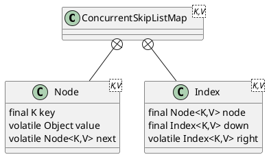

java.util.concurrent.ConcurrentSkipListMap

## hierarchy
```
AbstractMap (java.util)
    ConcurrentSkipListMap (java.util.concurrent)
ConcurrentSkipListMap (java.util.concurrent)
    AbstractMap (java.util)
        Map (java.util)
    Cloneable (java.lang)
    ConcurrentNavigableMap (java.util.concurrent)
        ConcurrentMap (java.util.concurrent)
            Map (java.util)
        NavigableMap (java.util)
            SortedMap (java.util)
                Map (java.util)
```

## define


## methods