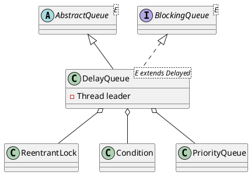

java.util.concurrent.DelayQueue

## hierarchy
```
AbstractCollection (java.util)
    AbstractQueue (java.util)
        DelayQueue (java.util.concurrent)
```
## define


## methods
* DelayQueue()
* DelayQueue(java.util.Collection<? extends E>)
* add
* offer(E)
* put
* offer(E, long, java.util.concurrent.TimeUnit)
* poll()
* take
* poll(long, java.util.concurrent.TimeUnit)
* peek
* size
* peekExpired
* drainTo(java.util.Collection<? super E>)
* drainTo(java.util.Collection<? super E>, int)
* clear
* remainingCapacity
* toArray()
* toArray(T[])
* remove
* removeEQ
* iterator