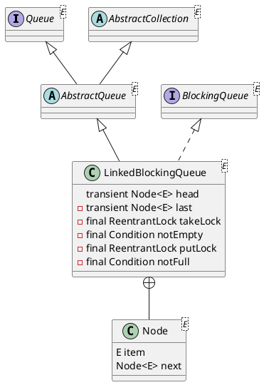

java.util.concurrent.LinkedBlockingQueue

## define

```plantuml
@startuml

interface Queue<E> 
interface BlockingQueue<E>

abstract class AbstractCollection<E>
abstract class AbstractQueue<E>

Queue ^-- AbstractQueue
AbstractCollection ^-- AbstractQueue

BlockingQueue ^.. LinkedBlockingQueue
AbstractQueue ^-- LinkedBlockingQueue

class LinkedBlockingQueue<E> {
    transient Node<E> head
    - transient Node<E> last
    - final ReentrantLock takeLock
    - final Condition notEmpty
    - final ReentrantLock putLock
    - final Condition notFull
}

LinkedBlockingQueue +-- Node

class Node<E> {
    E item
    Node<E> next
}

@enduml
```