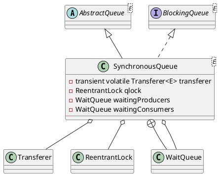

java.util.concurrent.SynchronousQueue

## hierarchy
```
AbstractCollection (java.util)
    AbstractQueue (java.util)
        SynchronousQueue (java.util.concurrent)
BlockingQueue (java.util.concurrent)
    Queue (java.util)
        Collection (java.util)
            Iterable (java.lang)
AbstractQueue (java.util)
    AbstractCollection (java.util)
        Queue (java.util)
            Collection (java.util)
                Iterable (java.lang)
```

## define
SynchronousQueue 是一个同步阻塞队列，它的每个插入操作都要等待其他线程相应的移除操作，反之亦然。
SynchronousQueue 像是生产者和消费者的会合通道，它比较适合“切换”或“传递”这种场景：
一个线程必须同步等待另外一个线程把相关信息/时间/任务传递给它。

