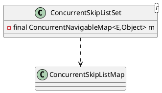

java.util.concurrent.ConcurrentSkipListSet

## hierarchy
```

```
## define

```plantuml
@startuml

class ConcurrentSkipListSet<E> {
    - final ConcurrentNavigableMap<E,Object> m
}

ConcurrentSkipListSet ..> ConcurrentSkipListMap

@enduml
```
