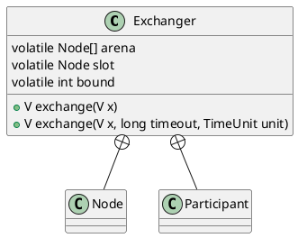

java.util.concurrent.Exchanger

## define

```plantuml
@startuml

class Exchanger {
    volatile Node[] arena
    volatile Node slot
    volatile int bound
    + V exchange(V x)
    + V exchange(V x, long timeout, TimeUnit unit)
}

class Node
class Participant 

Exchanger +-- Node
Exchanger +-- Participant

@enduml
```