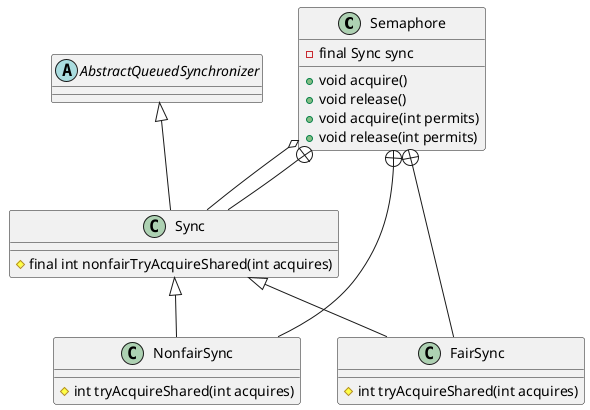

java.util.concurrent.Semaphore

## define

```plantuml
@startuml

class Semaphore {
    - final Sync sync
    + void acquire()
    + void release()
    + void acquire(int permits)
    + void release(int permits) 
}

Semaphore o-- Sync
Semaphore +-- Sync
Semaphore +-- NonfairSync
Semaphore +-- FairSync

abstract class AbstractQueuedSynchronizer 
AbstractQueuedSynchronizer ^-- Sync

class Sync {
    # final int nonfairTryAcquireShared(int acquires)
}
Sync ^-- NonfairSync
Sync ^-- FairSync

class NonfairSync {
    # int tryAcquireShared(int acquires)
}

class FairSync {
    # int tryAcquireShared(int acquires)
}


@enduml
```
