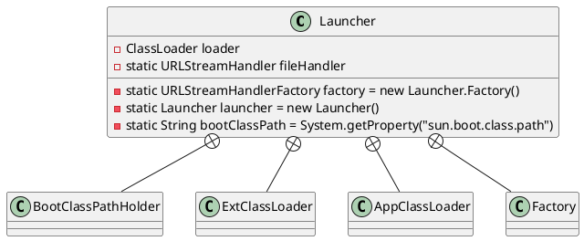

sun.misc.Launcher

## define

```plantuml
@startuml

class Launcher {
    - static URLStreamHandlerFactory factory = new Launcher.Factory()
    - static Launcher launcher = new Launcher()
    - static String bootClassPath = System.getProperty("sun.boot.class.path")
    - ClassLoader loader
    - static URLStreamHandler fileHandler
}

Launcher +-- BootClassPathHolder
Launcher +-- ExtClassLoader
Launcher +-- AppClassLoader
Launcher +-- Factory

class ExtClassLoader
class AppClassLoader

@enduml
```