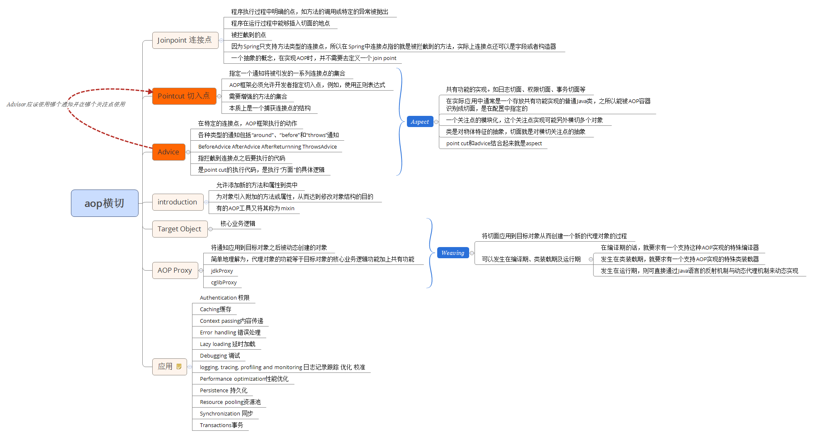

## aop
面向切面的编程，是一种编程技术，允许程序模块化横向切割关注点，或横切典型的责任划分，如日志和事务管理
AOP核心就是切面，它将多个类的通用行为封装成可重用的模块，该模块含有一组API提供横切功能。

## concept
1. 连接点 Joinpoint	一个应用程序的某个位置
2. 通知 Advice		在方法执行前或执行后要做的动作。
	spring五种类型通知
	- before
	- after
	- after-returing
	- after-throwing
	- around
3. 切点 Pointcut	一个或一组连接点，通知将在这些位置执行。可以通过表达式或匹配的方式指明切入点
4. advice + pointcut = aspect(advisor)
5. AOP proxy 将通知应用到目标对象之后创建的动态代理对象

 

## 实现
AOP实现的关键在于AOP框架自动创建的AOP代理，AOP代理主要分为静态代理和动态代理，静态代理的代表为AspectJ；而动态代理则以Spring AOP为代表。
动态代理就是说AOP框架不会去修改字节码，而是在内存中临时为方法生成一个AOP对象，这个AOP对象包含了目标对象的全部方法，并且在特定的切点做了增强处理，并回调原对象的方法。

两种方式
1.	jdk	通过反射来接收被代理的类，并且要求被代理的类必须实现一个接口	InvocationHandler接口和Proxy类
2.	cglib(Code Generation Library)	目标类没有实现接口，且没有被final修饰 		MethodInterceptor, Enhancer

## Spring中的Advisor，Advice，Point概述
1. Advisor：充当Advice和Pointcut的适配器，类似使用Aspect的@Aspect注解的类（前一章节所述）。一般有advice和pointcut属性。
祖先接口为org.springframework.aop.Advisor,应用中可直接使用org.springframework.aop.support.DefaultPointcutAdvisor
2. Advice：用于定义拦截行为，祖先接口为org.aopalliance.aop.Advice，该接口只是标识接口，应用中可直接实现BeforeAdvice ，ThrowsAdvice，MethodInterceptor ，AfterReturningAdvice ，IntroductionInterceptor 等子接口
3. Pointcut：用于定义拦截目标集合，祖先接口为org.springframework.aop.Pointcut

### 织入
在Java 语言中，从织入切面的方式上来看，存在三种织入方式：编译期织入、类加载期织入和运行期织入。
* 编译期织入是指在Java编译期，采用特殊的编译器，将切面织入到Java类中；
* 类加载期织入则指通过特殊的类加载器，在类字节码加载到JVM时，织入切面；
* 运行期织入则是采用CGLib工具或JDK动态代理进行切面的织入。

AspectJ采用编译期织入和类加载期织入的方式织入切面，是语言级的AOP实现，提供了完备的AOP支持。
它用AspectJ语言定义切面，在编译期或类加载期将切面织入到Java类中。  

AspectJ提供了两种切面织入方式，第一种通过特殊编译器，在编译期，将AspectJ语言编写的切面类织入到Java类中，
可以通过一个Ant或Maven任务来完成这个操作；第二种方式是类加载期织入，也简称为LTW（Load Time Weaving）。 

如何使用Load Time Weaving？首先，需要通过JVM的-javaagent参数设置LTW的织入器类包，以代理JVM默认的类加载器；
第二，LTW织入器需要一个 aop.xml文件，在该文件中指定切面类和需要进行切面织入的目标类。