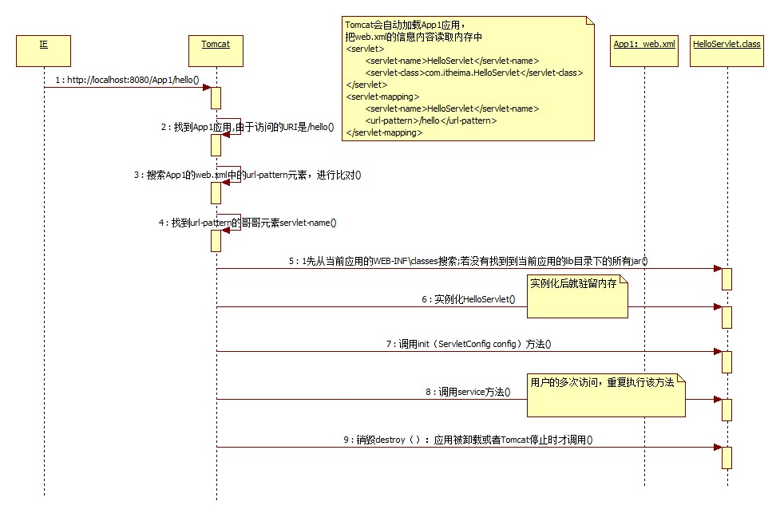

## tomcat package
```
servlet 规范
javax.security.auth.message
javax.servlet
org.apache.catalina
org.apache.coyote
org.apache.juli
org.apache.naming
org.apache.tomcat
```
### tomcat 设计模式
* facade ApplicationContextFacade
* chain of responsibility pipeline, valve
* factory ServerSocketFactory
* observer 

### Connector
* HTTP/AJP Connector
* Bio/Nio/Apr

每个ProtocolHandler内部都有一个Endpoint，ProtocolHandler初始化/启动的时候，将初始化/启动其内部的Endpoint
ProtocolHandler与Endpoint的对应关系 
* Http11Protocol/AjpProtocol使用JIoEndpoint 使用java io(也称为bio)技术，即一个请求对应一个线程。缺点：并发量高时，线程数较多，占资源
* Http11NioProtocol/AjpNioProtocol使用NioEndpoint 使用java nio技术，可以通过少量的线程处理大量的请求
* Http11AprProtocol/AjpAprProtocol使用AprEndpoint Apr即Apache Portable Runtime，从操作系统层面解决io阻塞问题。使用Apr时将用到Tomcat\bin\tcnative-1.dll (使用Apr时，应用了jni技术)。

## misc
* Jetty 是面向Handler的架构
* Spring 是面向Bean的架构
* iBATIS 是面向statement 

### tomcat-connector-container

### tomcat-engine-host-context-wapper

### tomcat-request-service

### tomcat-server

### tomcat-server.xml


***********************************************************************************************

# Tomcat component

## Server

* Connector
* Container, Engine, Host, Wrapper, Context
* Lifecycle
* pipeline, valve
* Executor
* Boostrap, Catalina

## ClassLoader

* bootstrap, extension, system
* tomcat classloader
* webapp classloader

## javax.servlet

```
annotation
descriptor
http
    Cookie
    HttpServletRequest
    HttpServertResponse
    HttpSession
resources

Filter
FilterChain
FilterConfig
Registration

Servlet
ServletConfig
ServletContext

ServletRequest
ServletResponse
```

## Connector

Connector使用ProtocolHandler来处理请求的，不同的ProtocolHandler代表不同的连接类型，
比如：Http11Protocol使用的是普通Socket来连接的，Http11NioProtocol使用的是NioSocket来连接的。

```
    Endpoint  --> TCP/IP  --> Acceptor, Handler, AsyncTimeout
    Processor --> HTTP
    Adaper
```

其中ProtocolHandler由包含了三个部件：Endpoint、Processor、Adapter。
1. Endpoint用来处理底层Socket的网络连接，Processor用于将Endpoint接收到的Socket封装成Request，Adapter用于将Request交给Container进行具体的处理。
2. Endpoint由于是处理底层的Socket网络连接，因此Endpoint是用来实现TCP/IP协议的，而Processor用来实现HTTP协议的，Adapter将请求适配到Servlet容器进行具体的处理。
3. Endpoint的抽象实现AbstractEndpoint里面定义的Acceptor和AsyncTimeout两个内部类和一个Handler接口。
Acceptor用于监听请求，AsyncTimeout用于检查异步Request的超时，Handler用于处理接收到的Socket，在内部调用Processor进行处理。

## Container

1. Engine：引擎，用来管理多个站点，一个Service最多只能有一个Engine； 
2. Host：代表一个站点，也可以叫虚拟主机，通过配置Host就可以添加站点； 
3. Context：代表一个应用程序，对应着平时开发的一套程序，或者一个WEB-INF目录以及下面的web.xml文件； 
4. Wrapper：每一Wrapper封装着一个Servlet；

## Container使用Pipeline-Value管道处理请求

Pipeline-Value是责任链模式，责任链模式是指在一个请求处理的过程中有很多处理者依次对请求进行处理，每个处理者负责做自己相应的处理，
处理完之后将处理后的请求返回，再让下一个处理着继续处理。

1. Connector在接收到请求后会首先调用最顶层容器的Pipeline来处理
2. StandardEngineValue --> StandardHostValue --> StandardContextValue --> StandardWrapperValue
3. StandardWrapperValue --> FilterChain --> Filter的doFilter()和Servlet的service()
4. 当所有的Pipeline-Value都执行完之后，并且处理完了具体的请求，将返回的结果交给Connector了，Connector在通过Socket的方式将结果返回给客户端。
