# View Image

this is generated files, just for view image conveniently...

## common-jars.png

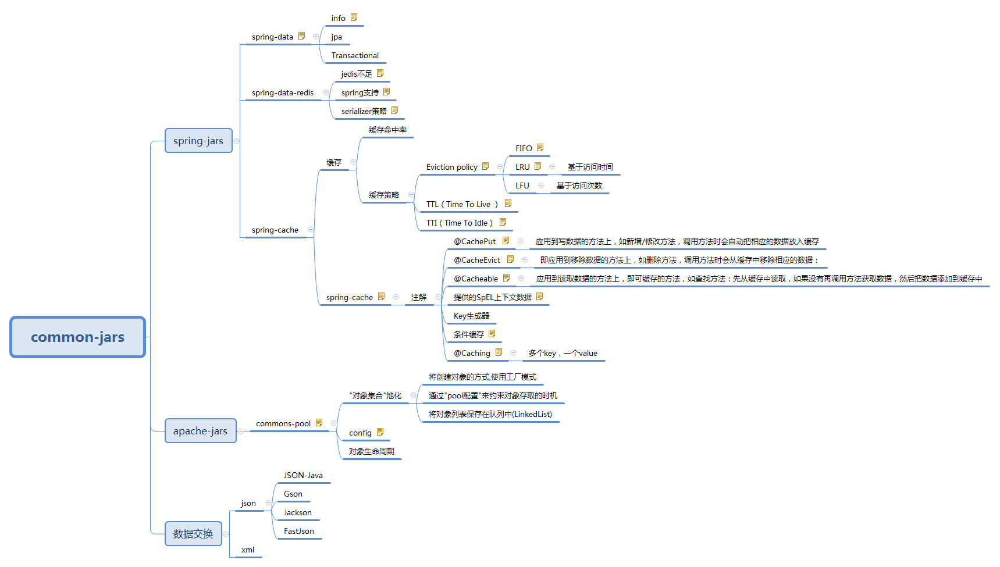

## event-group.png

## filter-chain.png

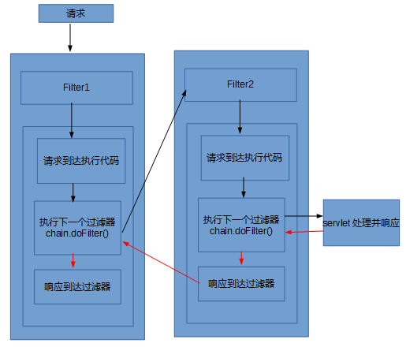

## mybatis-cache-session-mapper.jpg

## mybatis-cache.png

## mybatis-hierarchy.png

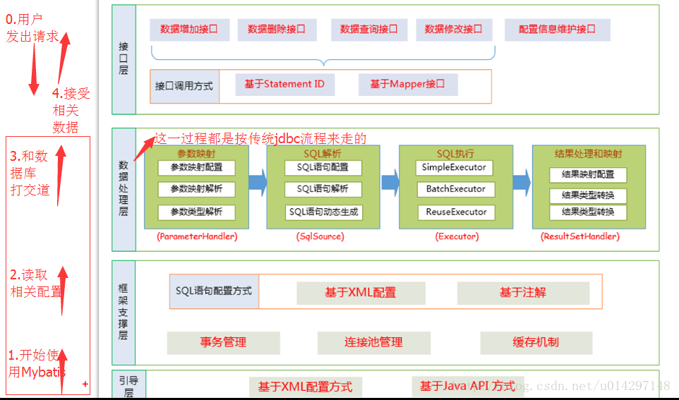

## mybatis-idea-MapperScannerConfigurer.png

## mybatis-idea-SqlSessionFactoryBean.png

## mybatis-simple.jpg

## mybatis.png

## netty-components.png

## netty-idea-EventLoop-methods.png

## netty-idea-EventLoop.png

## netty-idea-EventLoopGroup-methods.png

## netty-idea-EventLoopGroup.png

## netty.png

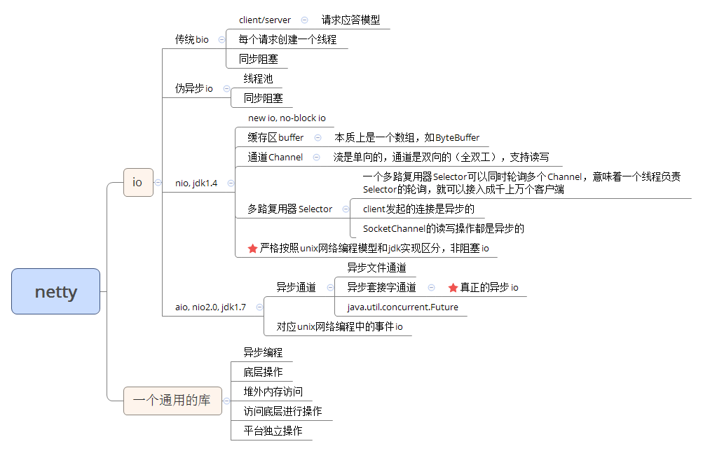

## redis-app1.jpg

## redis-app2.jpg

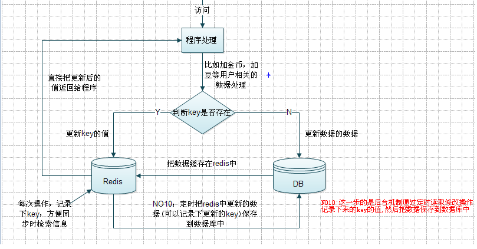

## servlet-config-context.jpg

## spring-aop-concept.png

## spring-beanfactory-init.png

## spring-beanfactory.png

## spring-beans-hierarchy.jpg

## spring-beans-life-00.png

## spring-beans-life-01.png

## spring-beans-life-02.jpg

## spring-beans-life.png

## spring-beans-parser.png

## spring-beans-scope.png

## spring-cache-el.jpg

## spring-cloud-knowledge.jpg

## spring-cloud-provider-consumer-eureka.png

## spring-cloud-structure.jpg

## spring-context-package.png

## spring-core-context-beans.png

## spring-core-jar.png

## spring-core.png

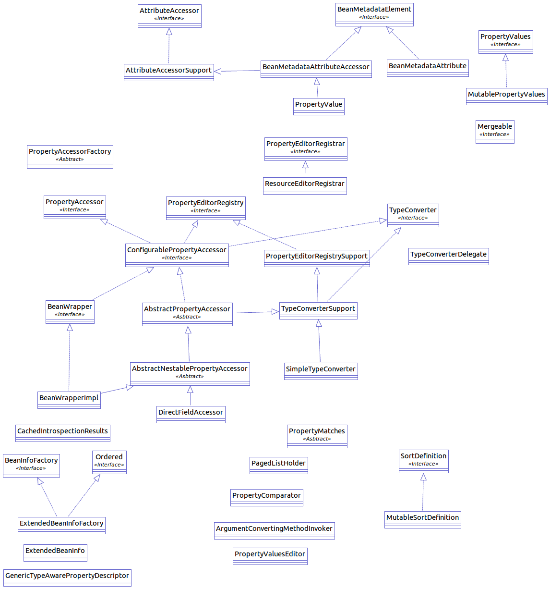

## spring-data-repository.jpg

## spring-data.jpg

## spring-factory-bean-start.jpg

## spring-framework.png

## spring-getbean.jpg

## spring-idea-AbstractApplicationContext-field.png

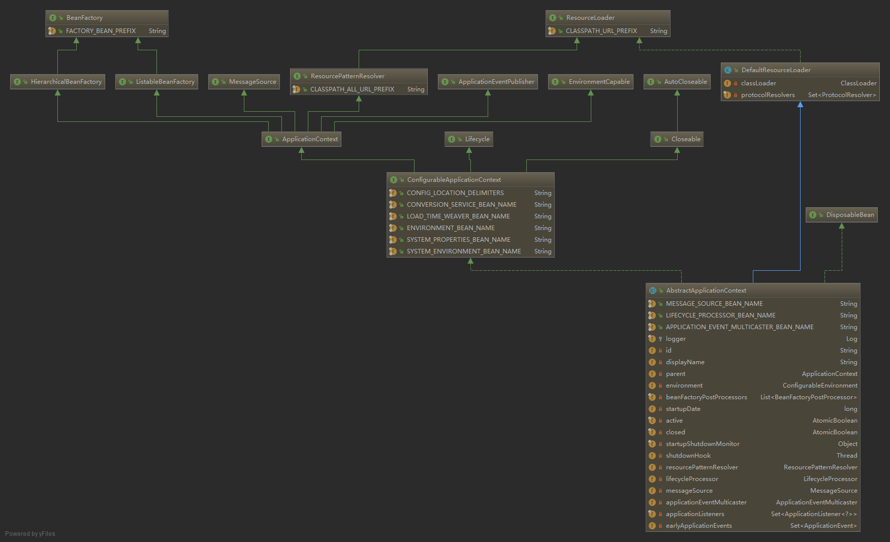

## spring-idea-AbstractApplicationContext.png

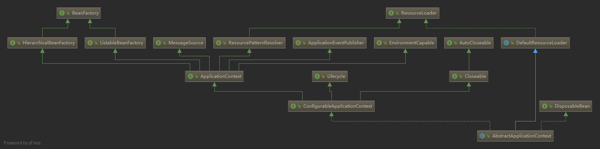

## spring-idea-AnnotatedGenericBeanDefinition.png

## spring-idea-AnnotationConfigEmbeddedWebApplicationContext-fields.png

## spring-idea-AnnotationConfigEmbeddedWebApplicationContext.png

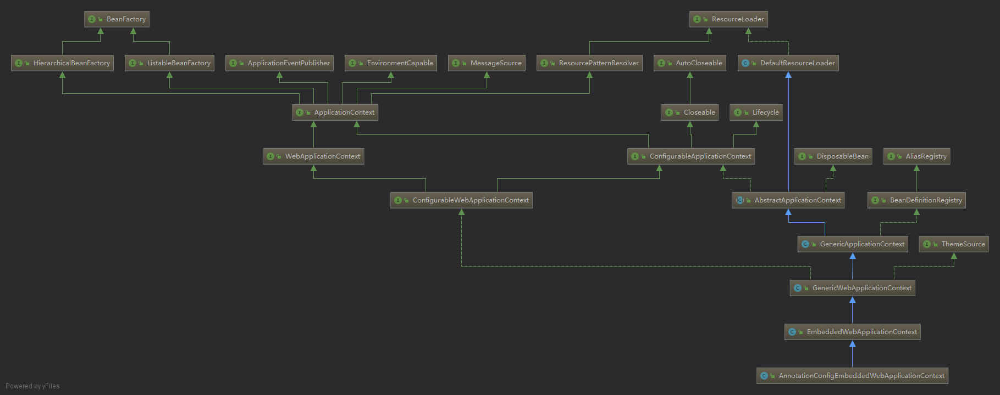

## spring-idea-AnnotationConfigServletWebServerApplicationContext.png

## spring-idea-ApplicationContext-methods.png

## spring-idea-ApplicationContext.png

## spring-idea-BeanDefinition.png

## spring-idea-ConfigurableWebApplicationContext-methods.png

## spring-idea-ConfigurableWebApplicationContext.png

## spring-idea-DefaultListableBeanFactory-fileds.png

## spring-idea-DefaultListableBeanFactory.png

## spring-idea-RootBeanDefinition.png

## spring-idea-ScannedGenericBeanDefinition.png

## spring-idea-WebApplicationContext.png

## spring-idea-XmlWebApplicationContext-fields.png

## spring-idea-XmlWebApplicationContext.png

## spring-jars-dependency.jpg

## spring-mvc-context-start.jpg

## spring-mvc-start.jpg

## spring-tx-idea-TransactionInterceptor.png

## springaop-cache.png

## springmvc-data-transform.PNG

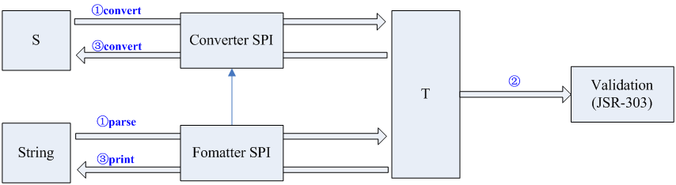

## springmvc-dispatcherservlet-dodispatch.png

## springmvc-dispatcherservlet-init.png

## springmvc-dispatcherservlet-view-render.png

## springmvc-dispatcherservlet.png

## springmvc-http-message-converter.png

## springmvc.JPG

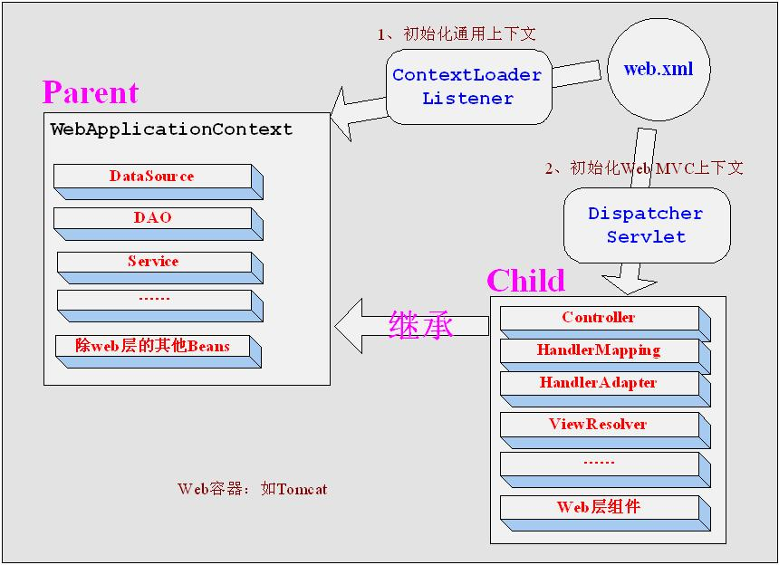

## tomcat-connector-container.jpg

## tomcat-engine-host-context-wapper.jpg

## tomcat-jio-protocol-endpoint-processor.png

## tomcat-nio-protocol-endpoint-processor.png

## tomcat-request-service.jpg

## tomcat-server.jpg

## tomcat-server.xml.jpg

## 多个拦截器执行顺序.png

