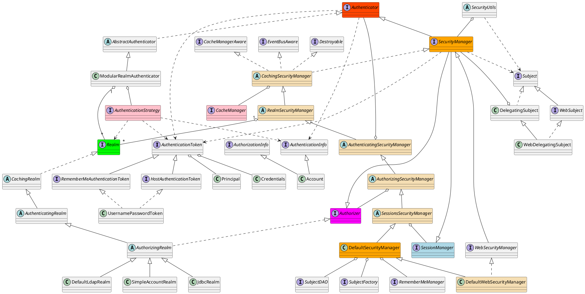

org.apache.shiro

## jars
```
Maven: org.apache.shiro:shiro-cache:1.4.0
Maven: org.apache.shiro:shiro-config-core:1.4.0
Maven: org.apache.shiro:shiro-config-ogdl:1.4.0
Maven: org.apache.shiro:shiro-core:1.4.0
Maven: org.apache.shiro:shiro-crypto-cipher:1.4.0
Maven: org.apache.shiro:shiro-crypto-core:1.4.0
Maven: org.apache.shiro:shiro-crypto-hash:1.4.0
Maven: org.apache.shiro:shiro-event:1.4.0
Maven: org.apache.shiro:shiro-lang:1.4.0
Maven: org.apache.shiro:shiro-spring:1.4.0
Maven: org.apache.shiro:shiro-web:1.4.0
```

## package
```
aop
    AnnotationHandler
    MethodInterceptor
    MethodInvocation
    MethodInterceptorSupport
authc
    credential
        CredentialsMatcher
        HashingPasswordService
        PasswordService
    pam
    Account
    Authenticator
    AuthenticationInfo
    AuthenticationListener
    AuthenticationToken
    HostAuthenticationToken
    LogoutAware
    MergableAuthenticationInfo
    RememberMeAuthenticationToken
    SaltedAuthenticationInfo
authz
    annotation
        Logical
        RequiresAuthentication
        RequiresGuest
        RequiresPermissions
        RequiresRoles
        RequiresUser
    aop
    permission
    AuthorizationInfo
    Authorizer
    Permission
cache
    AbstractCacheManager
    Cache
    CacheManager
    CacheManagerAware
    MapCache
    MemoryConstrainedCacheManager
codec
    Base64
    CodecSupport
    H64
    Hex
concurrent
    SubjectAwareExecutor
    SubjectAwareExecutorService
    SubjectAwareScheduledExecutorService
config
    Ini
    Interpolator
    ResourceConfigurable
crypto
    hash
        Hash
        Md5Hash
        Sha256Hash
        HashService
    BlowfishCipherService
    RandomNumberGenerator
    CipherService
dao
env
    Environment
    NamedObjectEnvironment
event
    EventBus
    EventBusAware
    Subscribe
    Event
io
jndi
ldap
mgt
    AbstractRememberMeManager
    AuthenticatingSecurityManager
    AuthorizingSecurityManager
    CachingSecurityManager
    DefaultSecurityManager
    DefaultSessionStorageEvaluator
    DefaultSubjectDAO
    DefaultSubjectFactory
    RealmSecurityManager
    RememberMeManager
    SecurityManager
    SessionsSecurityManager
    SessionStorageEvaluator
    SubjectDAO
    SubjectFactory
realm
    AuthenticatingRealm
    AuthorizingRealm
    CachingRealm
    Realm
    RealmFactory
    SimpleAccountRealm
session
    mgt
        SessionManager
    Session
    SessionListener
subject
    Subject
    SubjectContext
    PrincipalCollection
    PrincipalMap
util
    Destroyable
    Factory
    Initializable
    Nameable
    PatternMatcher
    ThreadState
    ThreadContext
SecurityUtils
ShiroException
UnavailableSecurityManagerException
```

## overview


