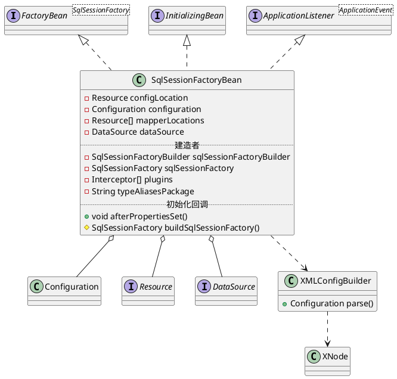
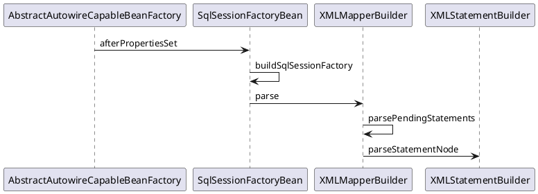

org.mybatis.spring.SqlSessionFactoryBean

## define


## methods


## invoke
afterPropertiesSet()
buildSqlSessionFactory()



```
parseStatementNode:58, XMLStatementBuilder (org.apache.ibatis.builder.xml)
parsePendingStatements:178, XMLMapperBuilder (org.apache.ibatis.builder.xml)
parse:99, XMLMapperBuilder (org.apache.ibatis.builder.xml)
buildSqlSessionFactory:521, SqlSessionFactoryBean (org.mybatis.spring)
afterPropertiesSet:380, SqlSessionFactoryBean (org.mybatis.spring)
invokeInitMethods:1641, AbstractAutowireCapableBeanFactory (org.springframework.beans.factory.support)
initializeBean:1578, AbstractAutowireCapableBeanFactory (org.springframework.beans.factory.support)
doCreateBean:545, AbstractAutowireCapableBeanFactory (org.springframework.beans.factory.support)
createBean:482, AbstractAutowireCapableBeanFactory (org.springframework.beans.factory.support)
getObject:306, AbstractBeanFactory$1 (org.springframework.beans.factory.support)
getSingleton:230, DefaultSingletonBeanRegistry (org.springframework.beans.factory.support)
doGetBean:302, AbstractBeanFactory (org.springframework.beans.factory.support)
getBean:197, AbstractBeanFactory (org.springframework.beans.factory.support)
```