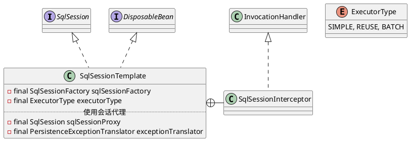

org.mybatis.spring.SqlSessionTemplate

## define


## invoke

```
// spring-mybatis
invoke:433, SqlSessionTemplate$SqlSessionInterceptor (org.mybatis.spring)
selectList:-1, $Proxy91 (com.sun.proxy)
selectList:230, SqlSessionTemplate (org.mybatis.spring)

// MapperProxy
executeForMany:137, MapperMethod (org.apache.ibatis.binding)
execute:75, MapperMethod (org.apache.ibatis.binding)
invoke:59, MapperProxy (org.apache.ibatis.binding)
selectList:-1, $Proxy92 (com.sun.proxy)
```