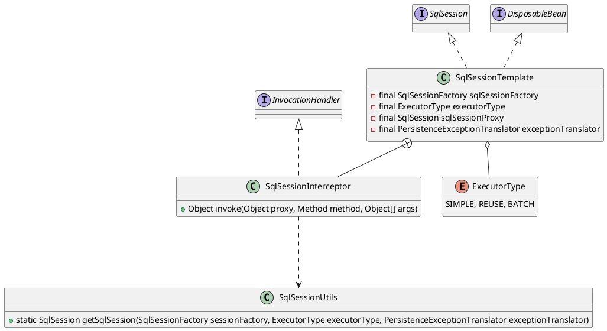

org.mybatis.spring.SqlSessionTemplate

## define
线程安全的、spring事务管理的

* 内部类
  * SqlSessionInterceptor 拦截会话
* 实例域
  * 需要SqlSessionFactory生产会话
  * 将mybatis持久层异常转换成未检查的数据访问层异常
  * sqlSessionProxy 使用会话代理
* 实例方法



## stack

```
// spring-mybatis
invoke:433, SqlSessionTemplate$SqlSessionInterceptor (org.mybatis.spring)
selectList:-1, $Proxy91 (com.sun.proxy)  jdk动态代理
selectList:230, SqlSessionTemplate (org.mybatis.spring)

// MapperProxy
executeForMany:137, MapperMethod (org.apache.ibatis.binding)
execute:75, MapperMethod (org.apache.ibatis.binding)
invoke:59, MapperProxy (org.apache.ibatis.binding)
selectList:-1, $Proxy92 (com.sun.proxy)  jdk动态代理
```