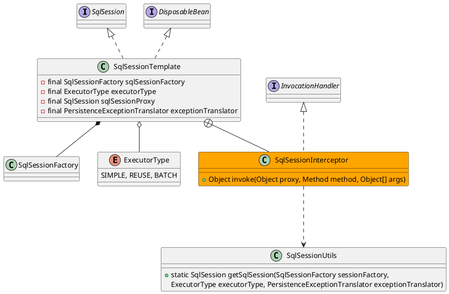

org.mybatis.spring.SqlSessionTemplate

## define
线程安全的、spring事务管理的

* 内部类
  * SqlSessionInterceptor 会话拦截器
* 实例域
  * sqlSessionFactory 需要SqlSessionFactory生产会话
  * PersistenceExceptionTranslator 将mybatis持久层异常转换成未检查的数据访问层异常
  * sqlSessionProxy 使用会话代理
* 实例方法



## methods

### 构造方法
```java
public SqlSessionTemplate(SqlSessionFactory sqlSessionFactory, ExecutorType executorType,
      PersistenceExceptionTranslator exceptionTranslator) {

    notNull(sqlSessionFactory, "Property 'sqlSessionFactory' is required");
    notNull(executorType, "Property 'executorType' is required");

    this.sqlSessionFactory = sqlSessionFactory;
    this.executorType = executorType;
    this.exceptionTranslator = exceptionTranslator;
    this.sqlSessionProxy = (SqlSession) newProxyInstance(
        SqlSessionFactory.class.getClassLoader(),
        new Class[] { SqlSession.class },
        new SqlSessionInterceptor());
  }
```

## stack

```
// spring-mybatis
invoke:433, SqlSessionTemplate$SqlSessionInterceptor (org.mybatis.spring)
selectList:-1, $Proxy91 (com.sun.proxy)  jdk动态代理
selectList:230, SqlSessionTemplate (org.mybatis.spring)

// MapperMethod
executeForMany:137, MapperMethod (org.apache.ibatis.binding)
execute:75, MapperMethod (org.apache.ibatis.binding)

// MapperProxy
invoke:59, MapperProxy (org.apache.ibatis.binding) 实现了 InvocationHandler.invoke
selectList:-1, $Proxy92 (com.sun.proxy)  jdk动态代理
```