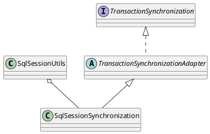

org.mybatis.spring.SqlSessionUtils

## define

```plantuml
@startuml

class SqlSessionUtils {

}

interface TransactionSynchronization
TransactionSynchronization ^.. TransactionSynchronizationAdapter

abstract class TransactionSynchronizationAdapter
TransactionSynchronizationAdapter ^-- SqlSessionSynchronization

class SqlSessionSynchronization {

}
SqlSessionUtils o-- SqlSessionSynchronization

@enduml
```