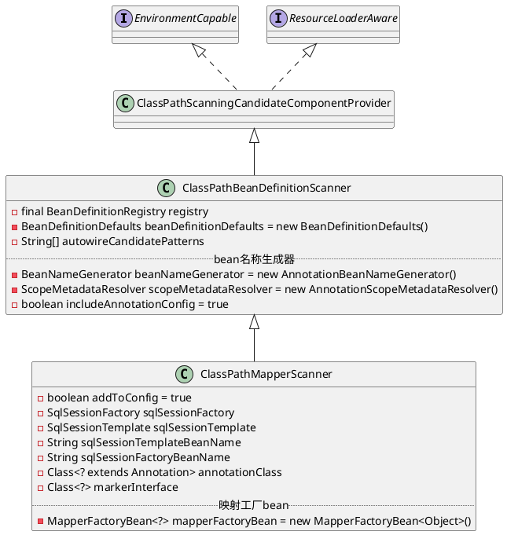

org.mybatis.spring.mapper.ClassPathMapperScanner

## package
```
ClassPathScanningCandidateComponentProvider (org.springframework.context.annotation)
    ClassPathBeanDefinitionScanner (org.springframework.context.annotation)
        ClassPathMapperScanner (org.mybatis.spring.mapper)
```
## define
