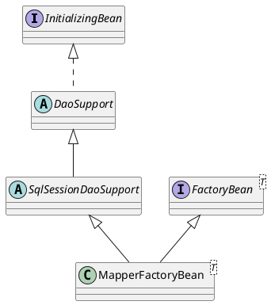

org.mybatis.spring.mapper.MapperFactoryBean

## package
```
DaoSupport (org.springframework.dao.support)
    SqlSessionDaoSupport (org.mybatis.spring.support)
        MapperFactoryBean (org.mybatis.spring.mapper)
```

## define
