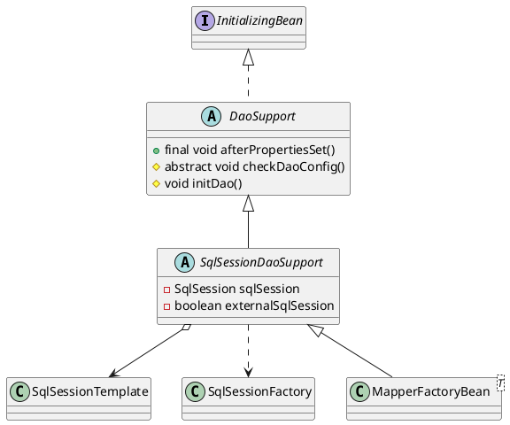

org.mybatis.spring.support.SqlSessionDaoSupport

## hierarchy
```
DaoSupport (org.springframework.dao.support)
    SqlSessionDaoSupport (org.mybatis.spring.support)
        MapperFactoryBean (org.mybatis.spring.mapper)
    CciDaoSupport (org.springframework.jca.cci.core.support)
    JdbcDaoSupport (org.springframework.jdbc.core.support)
```

## define
