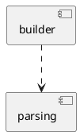

## mybatis

## package
org.apache.ibatis
```
    annotations
    binding
        MapperMethod
        MapperProxy
        MapperRegistry
    builder
        BaseBuilder
    cache
    cursor
    datasource
        DataSourceFactory
    exceptions
    executor
        BaseExecutor
    io
    javassist
    jdbc
    lang
    logging
    mapping
        MappedStatement
    ognl
        TypeConverter
    parsing
        XPathParser
    plugin
        Interceptor
        InterceptorChain
        Invocation
        Plugin
    reflection
    scripting
    session
    transaction
    type
        TypeHandler
```

## overview
