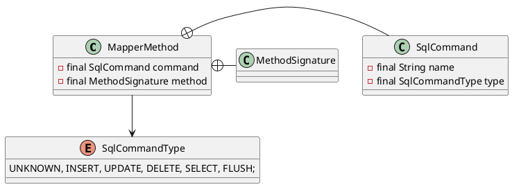

## define

```plantuml
@startuml

class MapperMethod {
    - final SqlCommand command
    - final MethodSignature method
}

class SqlCommand {
    - final String name
    - final SqlCommandType type
}

class MethodSignature {
}

MapperMethod +- SqlCommand
MapperMethod +- MethodSignature
MapperMethod --> SqlCommandType

enum SqlCommandType {
  UNKNOWN, INSERT, UPDATE, DELETE, SELECT, FLUSH;
}
@enduml

```

## execute()
* 根据command类型判断 增删改查、刷新