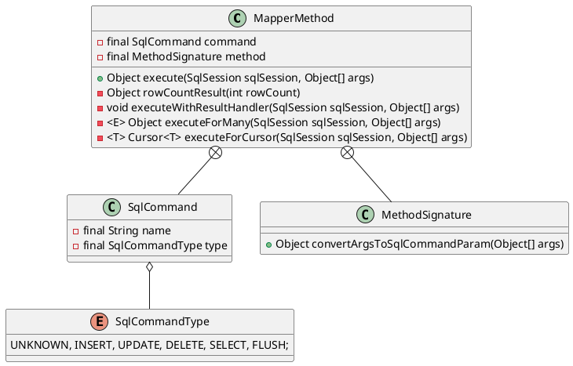

org.apache.ibatis.binding.MapperMethod

## define
* 内部类
  * ParamMap
  * SqlCommand
  * MethodSignature
* 实例域
* 实例方法
  * execute 根据sql命令类型调用不同的方法
    * rowCountResult
    * executeWithResultHandler
    * executeForMany
    * executeForCursor

## execute()
* 根据command类型判断 增删改查、刷新
* rowCountResult 受影响的行数（增、删、改）