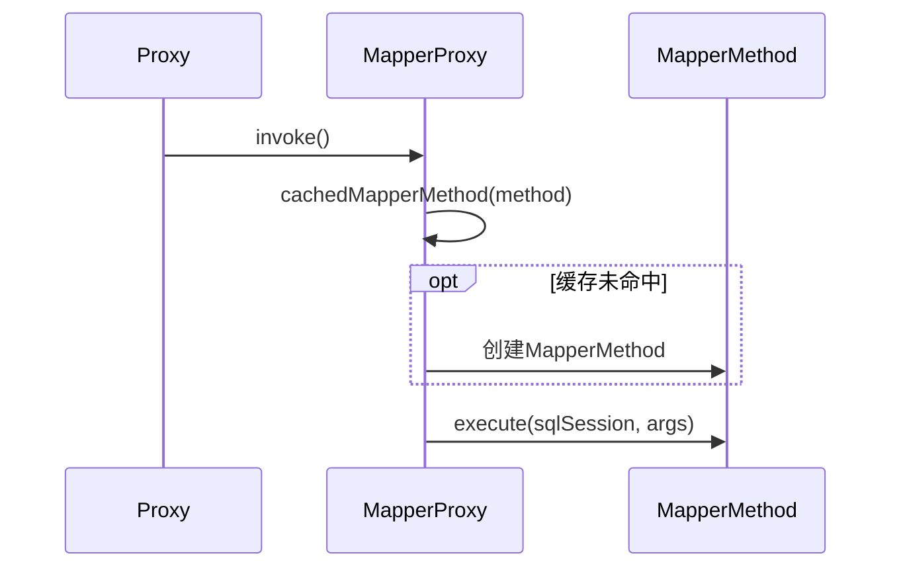

## define
```java
public class MapperProxy<T> implements InvocationHandler, Serializable {
  private final SqlSession sqlSession;
  private final Class<T> mapperInterface;
  private final Map<Method, MapperMethod> methodCache;
}
```

## invoke

