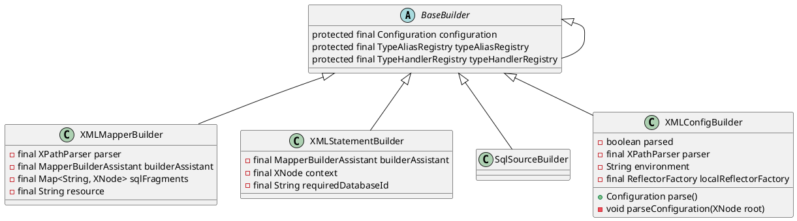

org.apache.ibatis.builder.BaseBuilder

## hierarchy
```
BaseBuilder (org.apache.ibatis.builder)
    XMLMapperBuilder (org.apache.ibatis.builder.xml)
    ParameterMappingTokenHandler in SqlSourceBuilder (org.apache.ibatis.builder)
    MybatisXMLConfigBuilder (com.baomidou.mybatisplus.core)
    MapperBuilderAssistant (org.apache.ibatis.builder)
    XMLScriptBuilder (org.apache.ibatis.scripting.xmltags)
    XMLConfigBuilder (org.apache.ibatis.builder.xml)
    SqlSourceBuilder (org.apache.ibatis.builder)
    XMLStatementBuilder (org.apache.ibatis.builder.xml)
```

## define


