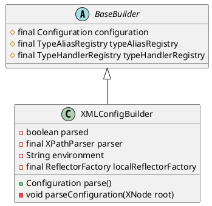

org.apache.ibatis.builder.xml.XMLConfigBuilder

## hierarchy
```
BaseBuilder (org.apache.ibatis.builder)
    XMLMapperBuilder (org.apache.ibatis.builder.xml)
    ParameterMappingTokenHandler in SqlSourceBuilder (org.apache.ibatis.builder)
    MybatisXMLConfigBuilder (com.baomidou.mybatisplus.core)
    MapperBuilderAssistant (org.apache.ibatis.builder)
    XMLScriptBuilder (org.apache.ibatis.scripting.xmltags)
    XMLConfigBuilder (org.apache.ibatis.builder.xml)
    SqlSourceBuilder (org.apache.ibatis.builder)
    XMLStatementBuilder (org.apache.ibatis.builder.xml)
```

## package

## parse()
* 解析 configuration

## parseConfiguration
void parseConfiguration(XNode root)
* 解析 properties
* 解析 settings
* 解析 typeAliases
* 解析 plugins
* 解析 objectFactory
* 解析 objectWrapperFactory
* 解析 reflectorFactory
* 解析 environments
* 解析 databaseIdProvider
* 解析 typeHandlers
* 解析 mappers
