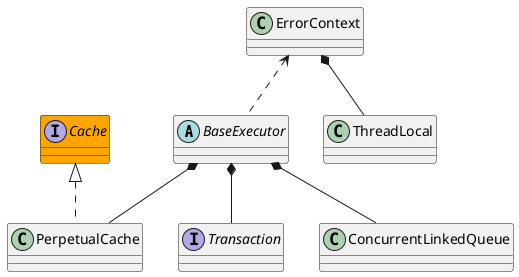

org.apache.ibatis.executor.BaseExecutor

* ConcurrentLinkedQueue 基于Unsafe.cas，而不是ReentrantLock
* 模板方法模式

## hierarchy
```
BaseExecutor (org.apache.ibatis.executor)
    SimpleExecutor (org.apache.ibatis.executor)
    ClosedExecutor in ResultLoaderMap (org.apache.ibatis.executor.loader)
    ReuseExecutor (org.apache.ibatis.executor)
    BatchExecutor (org.apache.ibatis.executor)
```
## define



## methods
* <E> List<E> queryFromDatabase(MappedStatement ms, Object parameter, RowBounds rowBounds, ResultHandler resultHandler, CacheKey key, BoundSql boundSql)
* abstract int doUpdate(MappedStatement ms, Object parameter)
* abstract <E> List<E> doQuery(MappedStatement ms, Object parameter, RowBounds rowBounds, ResultHandler resultHandler, BoundSql boundSql)
* abstract <E> Cursor<E> doQueryCursor(MappedStatement ms, Object parameter, RowBounds rowBounds, BoundSql boundSql)