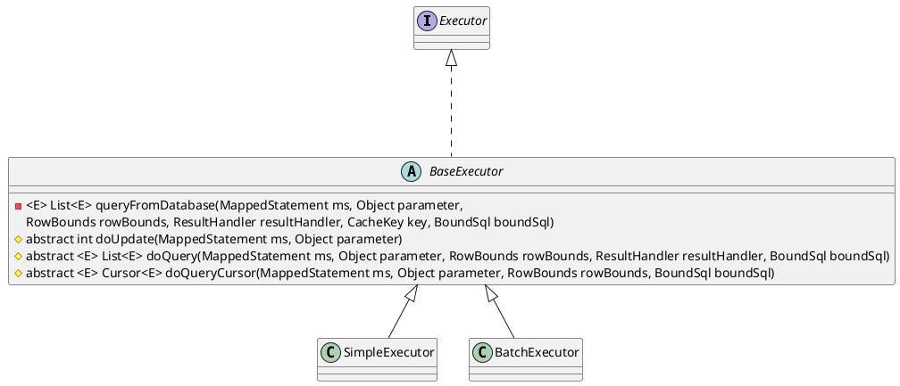

org.apache.ibatis.executor.Executor

## hierarchy
```
Executor (org.apache.ibatis.executor)
    CachingExecutor (org.apache.ibatis.executor)
    BaseExecutor (org.apache.ibatis.executor)
        SimpleExecutor (org.apache.ibatis.executor)
        ClosedExecutor in ResultLoaderMap (org.apache.ibatis.executor.loader)
        ReuseExecutor (org.apache.ibatis.executor)
        BatchExecutor (org.apache.ibatis.executor)
```

## define
