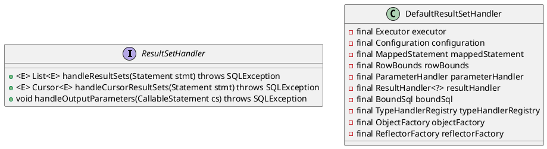

org.apache.ibatis.executor.resultset.ResultSetHandler

## hierarchy
```
ResultSetHandler (org.apache.ibatis.executor.resultset)
    DefaultResultSetHandler (org.apache.ibatis.executor.resultset)
```
## define



